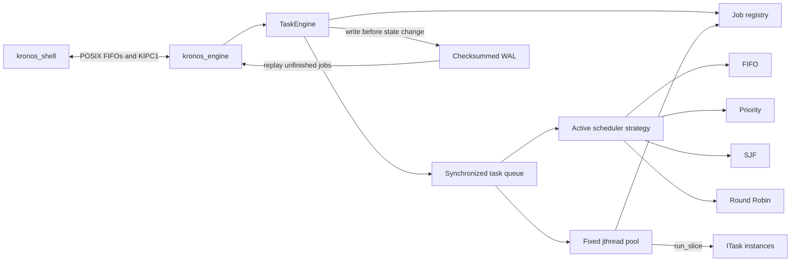
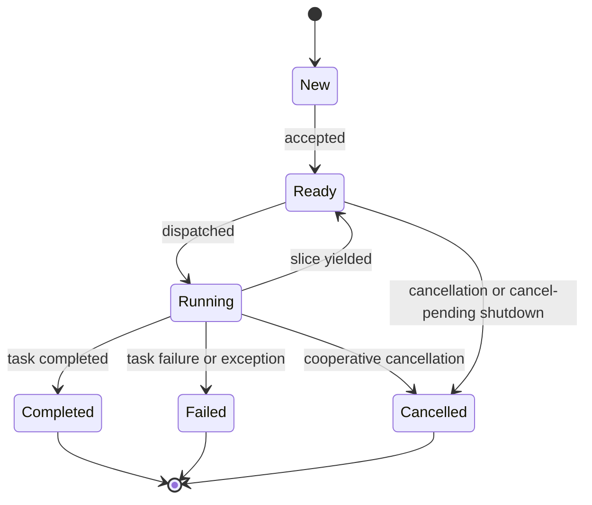

# Kronos Architecture

## Components and ownership



The daemon exclusively owns the FIFOs, WAL, task factory, `TaskEngine`, and
completion observers. `TaskEngine` owns job records, task instances,
cancellation sources, result promises, the queue, and worker threads. A queued
scheduler entry contains only immutable ordering metadata and a job identifier.
Workers resolve that ID through the registry before executing it.

## Task and scheduling contract

Every task is a stateful object implementing:

```cpp
SliceResult run_slice(const TaskContext& context);
```

The context contains a stop token and a maximum number of task-defined work
units. Round Robin supplies its configured quantum. Other strategies supply an
unlimited budget and therefore remain run-to-completion unless a task voluntarily
yields.

A yielded job is put at the back of the active strategy. A runtime strategy
change drains queued entries while holding the queue mutex, constructs the new
ordering, and wakes sleeping workers. A task already executing is never
preempted; its next yield is enqueued under the replacement strategy.

## Lifecycle



`Completed`, `Failed`, and `Cancelled` are terminal. They make the PRD's generic
`Terminated` state explicit and allow callers to distinguish outcomes without
parsing text.

## Synchronization invariants

1. The queue mutex protects the scheduler, its pending entries, scheduler
   replacement, and queue closure.
2. The registry reader/writer mutex protects all mutable job snapshots and
   terminal-result publication.
3. Task code runs without either engine mutex held.
4. Queue operations and registry operations are never nested, preventing a lock
   order cycle.
5. Each scheduler entry is removed before execution and reinserted only after a
   yielded slice, so at most one worker can execute a task at once.
6. Terminal result promises are published exactly once while changing the job
   to its terminal state.
7. With a journal configured, its append and `fsync` complete while the registry
   transition is serialized and before the new state becomes visible.

Snapshots take a shared registry lock and return copies ordered by submission
sequence. State transitions take the exclusive lock. The queue uses a condition
variable, so idle workers sleep instead of polling.

## Cancellation and shutdown

Each record owns a `std::stop_source`:

- Cancelling a ready job marks it terminal immediately. Its stale scheduler
  entry is harmlessly skipped when popped.
- Cancelling a running job requests cooperative stop. The task determines the
  cancellation latency by how frequently it checks the token.
- Drain shutdown closes external submission and lets queued and yielded work
  reach terminal states.
- Cancel-pending shutdown cancels jobs that are queued at closure while allowing
  already-running jobs to finish.

Kronos never kills threads or unwinds user code asynchronously.

## Failure handling

Exceptions escaping `run_slice` are caught at the worker boundary and converted
to a failed `JobResult`. A failed task cannot terminate its worker. Invalid
configuration and submissions fail synchronously with standard exceptions.

A journal write failure prevents the intended state transition and fails the
in-memory job. Complete WAL corruption prevents daemon startup; only an
incomplete final record is ignored as a torn append. An ungraceful process exit
leaves accepted non-terminal jobs available for at-least-once replay.

## Process boundary

The shell and daemon exchange newline-framed `KIPC1` messages through two named
pipes. Text fields are hex encoded, request IDs pair replies with commands, and
`EVENT` messages deliver terminal job notifications independently of command
responses. The shell listener thread is the only response FIFO reader.

The FIFO directory and endpoints must be owned by the current user. The server
may replace stale user-owned FIFOs but refuses to replace other filesystem
objects. This release deliberately supports one connected shell.

## Future compatibility

Job metadata is value-oriented and does not expose worker pointers or scheduler
containers. The journal is injected behind `IJobJournal`, while tasks are
reconstructed from `DurableTaskSpec`. These boundaries allow future storage,
task types, or network transports without changing worker-pool ownership.

Submitted source-code execution remains a planned extension rather than a
current capability. Its isolation boundary, scheduler implications, recovery
contract, and required security tests are defined in the
[sandbox roadmap](sandbox-roadmap.md).
